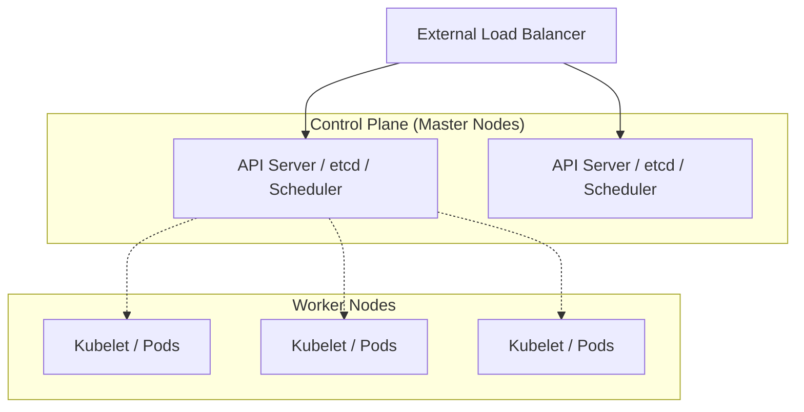
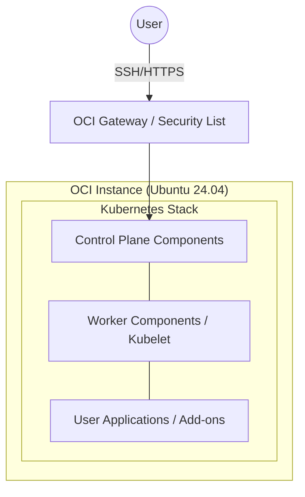

# Kubernetes詳細設計書 - infra-oci-ansible

## 1. 概要

本ドキュメントは、OCI上の Ubuntu 24.04 LTS インスタンスにおいて構築する Kubernetes (k8s) クラスターの詳細設計を定める。個人開発向けにリソース効率を重視し、シングルノード構成から開始しつつ、標準的なツールセットを備えた環境を実現する。

## 2. 構成・インストール

### 2.1. コンテナランタイム (containerd)

- **ランタイム**: `containerd`
- **設定方針**:
  - `SystemdCgroup = true` を有効化し、OS のリソース管理と統合。
  - 必要最小限のプラグインのみを有効化。

### 2.2. Kubernetes コンポーネント

- **構築ツール**: `kubeadm`, `kubelet`, `kubectl`
- **バージョン**: 最新の安定版（LTS またはその1つ前を推奨）
- **リポジトリ**: Google の公式 APT リポジトリを使用。

### 2.3. クラスター構成

- **ノード形態**: シングルノード（Control Plane と Worker を同一ノードに配置）。
- **Taint 解除**: `node-role.kubernetes.io/control-plane:NoSchedule` を解除し、マスターノード上での Pod 実行を許可する。

## 3. 詳細設計

### 3.1. クラスタ構成単位

本プロジェクトでは、リソース効率を最優先し、本来分離されるべきコントロールプレーンとワーカーノードを1つのインスタンスに集約する。

#### 3.1.1. 一般的なクラスタ構成 (マルチノード)

高可用性 (HA) を重視した構成では、コントロールプレーンを冗長化し、ワーカーノードを分離する。




#### 3.1.2. 本プロジェクトの構成 (シングルノード)

個人開発・学習用として、1台のOCIインスタンスに全コンポーネントを配置する。




- **構成の差異**:
  - **可用性**: シングルノードのため、インスタンス障害時は全サービスが停止する。
  - **リソース**: マスターコンポーネントとアプリがメモリ/CPUを競合するため、適切な Resource Quota の設定が重要となる。
  - **運用**: `Taint` を解除することで、マスター上での Pod 実行を許可している（2.3項参照）。

### 3.2. Kubernetesクラスタ・コントロールプレーン構成

kubeadmを使用して構成されるコントロールプレーンの基本方針。

- **API Server**: 外部公開範囲の制限（OCI Security Listによる制御）。
- **Etcd**: ローカルストレージを使用したシングル構成。

#### 3.2.1. アクセス制御：RBAC & 認証

- **認証**: X.509証明書およびServiceAccountトークン。
- **認可**: RBAC (Role-Based Access Control) を基本とし、最小権限の原則を適用。

### 3.3. ワーカー構成

ワーカーとしてPodを実行するためのコンポーネント（kubelet）およびホストOSレベルの設計方針。

#### 3.3.1. Kubelet構成（ワーカーコンポーネント）

- **Cgroup Driver**: OS(systemd)との整合性を保つため `systemd` を使用。
- **Eviction閾値**: ディスク空き容量不足等の際のPod強制退避（Eviction）条件をデフォルト値から必要に応じて調整。

#### 3.3.2. ノード運用設定

- **カーネルパラメータ**: `br_netfilter` 等、k8sの動作に必要なネットワーク設定の有効化。

### 3.4. Kubernetes構成

#### 3.4.1. Kubernetes構成：Namespace

- **方針**: 用途ごとにNamespaceを分離する。環境分離（dev/staging）は行わず、本番のみの構成とする。
- **構成例**:
  - `default` または `app-prod`: 本番アプリケーション
  - `ingress-nginx`: Ingress Controller
  - `monitoring`: 監視系（Metrics Server等）
- **Pod readiness gate**: LBなしのシングルノード構成のため使用しない。標準の `readinessProbe` で代替する。

#### 3.4.2. Kubernetes構成：Deployment

- **Graceful Shutdown対応**: `terminationGracePeriodSeconds` を適切に設定（デフォルト30秒、アプリ特性に応じ調整）。
- **Pod分散配置対応**: シングルノードのため現在は効果が限定的だが、`podAntiAffinity` 等の設定を標準化。

#### 3.4.3. Kubernetes構成：Job

- 定期バッチ処理や初期化処理に使用。`backoffLimit` を適切に設定。

#### 3.4.4. Kubernetes構成：DaemonSet

- ログ収集（Fluent-bit等）や監視エージェントに使用。

#### 3.4.5. Kubernetes構成：Service

- **Type**: `ClusterIP` を基本とし、外部公開は Ingress を経由。
- **DNS**: CoreDNSによる内部サービス解決。

#### 3.4.6. Kubernetes構成：Ingress

- **Ingress Controller**: `ingress-nginx`
- **公開方式**: `HostNetwork` (シングルノード環境でホストの 80/443 ポートを占有)
- **外部アクセス**: OCIのセキュリティ・リストで 80/443 ポートを開放し、外部から Kubernetes Ingress Controller Pod に直接アクセスする（ホストOS上のNginxは使用しない）。
- **SSL/TLS 終端**: Ingress Controller で SSL 終端を実施し、`cert-manager` による Let's Encrypt 証明書の自動管理を行う。

#### 3.4.7. Kubernetes構成：ConfigMap

- アプリケーション設定値の管理（ホストOS上のNginx関連定義ファイル等は管理しない）。

#### 3.4.8. Kubernetes構成：Secret

- 機密情報（パスワード、APIキー）の一次保管。k8s標準のSecretを使用。

#### 3.4.9. Kubernetes構成：SecretStore

- 外部シークレットマネージャー（OCI Vault等）との接続定義。

#### 3.4.10. Kubernetes構成：External Secret

- **役割**: `External Secrets Operator` を使用し、外部マネージャー（Vault）から k8s Secret へ自動同期。
- **Secret / SecretStore / External Secretの役割**:
  - `SecretStore`: 接続情報の定義。
  - `ExternalSecret`: どの値を同期するかの定義。
  - `Secret`: アプリが実際に参照するリソース。

#### 3.4.11. Kubernetes構成：Horizontal Pod Autoscaler (HPA)

- CPU/Memory使用率に基づくスケーリング。
- **stabilizationWindowSeconds**: スケーリングの頻度を抑え、フラッピングを防止するために設定。

#### 3.4.12. Kubernetes構成：ServiceAccount

- アプリケーションPodがAPIサーバーや他リソースにアクセスするための識別子。Namespaceごとに適切に管理。

#### 3.4.13. Kubernetes構成：Pod Disruption Budget (PDB)

- ノードメンテナンス時の最小可用Pod数を定義（シングルノードでは主に学習・定義目的）。

#### 3.4.14. Kubernetes構成：NodeClass

- ノード属性の定義。OCIインスタンスのシェイプやラベルの管理方針。

#### 3.4.15. Kubernetes構成：NodePool

- **Node Graceful Shutdown対応**: `kubelet` の設定により、OS終了時のPod安全停止を担保。

#### 3.4.16. Kubernetes構成：アドオン構成

- **CNI (Network)**: `Calico` または `Flannel` (Pod CIDR: 10.244.0.0/16)
- **CSI (Storage)**: `local-path-provisioner` (Rancher) による動的PVプロビジョニング。
- **Monitoring**: `Metrics Server` によるリソース監視。

## 4. セキュリティ・運用

- **API Server保護**: OCIセキュリティ・リストで特定IPのみ許可。
- **ログ管理**: `/var/log/pods/` のログをホスト側でローテーション、または収集ツールで転送。
- **バックアップ**: Etcdの定期スナップショットおよびPVデータのバックアップ。

## 5. 確認コマンド

- **ノード状態**: `kubectl get nodes -o wide`
- **リソース確認**: `kubectl get all -A`
- **HPA確認**: `kubectl get hpa`
- **ExternalSecret確認**: `kubectl get externalsecrets`

## 6. Ansible 実装ガイド (変更なし)

### 6.1. 変数構造案 (`vars/main.yml`)

```yaml
k8s_version: "1.30"
pod_network_cidr: "10.244.0.0/16"
k8s_master_ip: "10.0.0.10"
install_ingress_nginx: true
```

### 6.2. Role 構成案

1. **runtime**: `containerd` の導入とカーネルパラメータ (`br_netfilter` 等) の設定。
2. **kube-tools**: `kubeadm`, `kubelet`, `kubectl` の導入とホールド設定。
3. **init**: `kubeadm init` によるクラスター初期化と `kubeconfig` の配置。
4. **network**: CNI (Calico等) の適用。
5. **post-config**: Taint 解除、StorageClass の導入、Ingress Controller のセットアップ。

