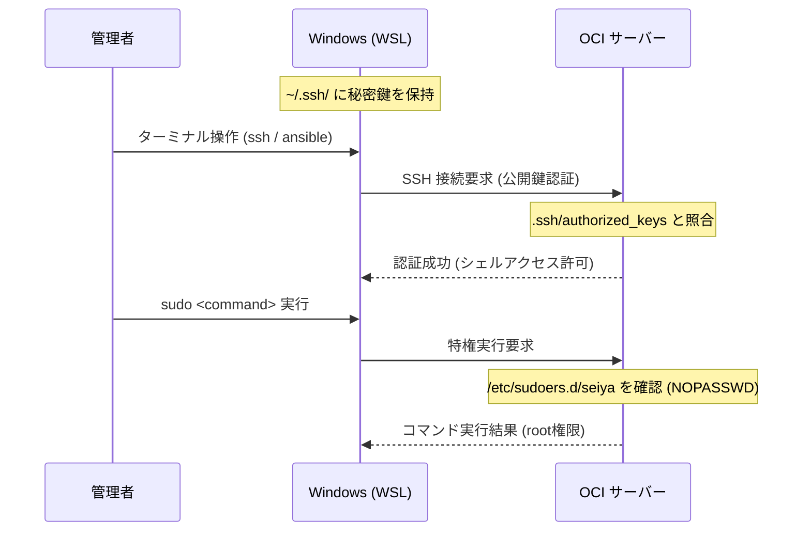

# OS詳細設計書 - infra-oci-ansible

## 目次

- [OS詳細設計書 - infra-oci-ansible](#os詳細設計書---infra-oci-ansible)
  - [目次](#目次)
  - [1. 概要](#1-概要)
  - [2. システム基本設定](#2-システム基本設定)
    - [2.1. ホスト名管理](#21-ホスト名管理)
    - [2.2. タイムゾーン・ロケール・文字コード](#22-タイムゾーンロケール文字コード)
    - [2.3. 時刻同期 (NTP)](#23-時刻同期-ntp)
    - [2.4. パッケージ管理 (apt)](#24-パッケージ管理-apt)
  - [3. ユーザー・グループ管理](#3-ユーザーグループ管理)
    - [3.1. ユーザー定義](#31-ユーザー定義)
    - [3.2. 認証・認可と環境設定](#32-認証認可と環境設定)
      - [認証・認可フロー (WSL前提)](#認証認可フロー-wsl前提)
  - [4. ネットワーク設計](#4-ネットワーク設計)
    - [4.1. IPアドレス・DNS](#41-ipアドレスdns)
    - [4.2. OS内ファイアウォール (ufw)](#42-os内ファイアウォール-ufw)
  - [5. ストレージ・ファイルシステム](#5-ストレージファイルシステム)
    - [5.1. ボリューム・パーティション構成](#51-ボリュームパーティション構成)
    - [5.2. スワップ領域](#52-スワップ領域)
    - [5.3. マウントオプションによる保護](#53-マウントオプションによる保護)
  - [6. セキュリティ堅牢化 (OS Hardening)](#6-セキュリティ堅牢化-os-hardening)
    - [6.1. SSH サービス設定 (`/etc/ssh/sshd_config.d/custom.conf`)](#61-ssh-サービス設定-etcsshsshd_configdcustomconf)
    - [6.2. カーネルパラメータ (`/etc/sysctl.d/99-security.conf`)](#62-カーネルパラメータ-etcsysctld99-securityconf)
    - [6.3. リソース・プロセス制限](#63-リソースプロセス制限)
    - [6.4. 侵入検知と監査](#64-侵入検知と監査)
  - [7. ログ管理・監視・運用](#7-ログ管理監視運用)
    - [7.1. ログ管理方針](#71-ログ管理方針)
    - [7.2. systemd-journald](#72-systemd-journald)
    - [7.3. ログローテーション (`logrotate`)](#73-ログローテーション-logrotate)
    - [7.4. OCI 特有の運用機能](#74-oci-特有の運用機能)
  - [8. バックアップ・リストア方針](#8-バックアップリストア方針)
    - [8.1. バックアップ](#81-バックアップ)
    - [8.2. リストア（環境再構築）](#82-リストア環境再構築)

---

## 1. 概要

本ドキュメントは、OCI (Oracle Cloud Infrastructure) 上で稼働する Ubuntu 24.04 LTS インスタンスにおける OS レイヤーの詳細設計を定める。本設計は Ansible による自動構築（Infrastructure as Code）を前提とし、冪等性とセキュアな初期状態を担保する。

## 2. システム基本設定

### 2.1. ホスト名管理

- **命名**: `oci-portfolio`
- **設定ファイル**: `/etc/hostname`, `/etc/hosts`
- **反映方法**: `hostnamectl` コマンドを使用。
- **確認コマンド**:
  - `hostnamectl status`
  - `cat /etc/hostname`
  - `cat /etc/hosts`

### 2.2. タイムゾーン・ロケール・文字コード

- **タイムゾーン**: `Asia/Tokyo`
- **ロケール**: `ja_JP.UTF-8` (デフォルト)
- **キーボードレイアウト**: `jp106`
- **設定ファイル**:
  - タイムゾーン: `/etc/timezone`, `/etc/localtime`
  - ロケール: `/etc/default/locale`, `/etc/locale.gen`
- **確認コマンド**:
  - `timedatectl`
  - `localectl status`
  - `locale`

### 2.3. 時刻同期 (NTP)

- **ツール**: `systemd-timesyncd`
- **参照先**: OCI メタデータ/NTPサーバー (`169.254.169.254`) を優先。
- **設定ファイル**: `/etc/systemd/timesyncd.conf`
- **確認コマンド**:
  - `timedatectl show-timesync --all`
  - `systemctl status systemd-timesyncd`

### 2.4. パッケージ管理 (apt)

- **リポジトリ管理**: Ubuntu 24.04 準拠の DEB822 フォーマット (`/etc/apt/sources.list.d/ubuntu.sources`) を使用。
- **自動更新 (`unattended-upgrades`)**:
  - セキュリティアップデートのみ自動適用。
  - 更新後の自動再起動機能は「無効」。メンテナンス窓にて手動（またはジョブ）で実施する。
- **自動化阻害の抑止 (`needrestart`)**:
  - パッケージ更新時に表示される対話型プロンプトを抑制するため、`/etc/needrestart/needrestart.conf` にて `$nrconf{restart} = 'a';` (自動再起動) または `'l'` (リスト表示のみ) を設定し、Ansible の実行停止を防ぐ。
- **共通導入パッケージ**:
  - 管理: `vim`, `tmux`, `git`, `curl`, `wget`, `rsync`, `htop`, `tree`, `jq`
  - ネットワーク: `net-tools`, `iputils-ping`, `traceroute`, `dnsutils`
  - システム・セキュリティ: `software-properties-common`, `unzip`, `ufw`, `cloud-utils`, `auditd`, `apparmor-utils`
  - バックエンド・DB (ホスト導入用): `php-cli`, `php-fpm`, `php-mysql`, `php-mbstring`, `php-xml`, `php-curl`, `mysql-server`, `mysql-client`
- **設定ファイル**:
  - リポジトリ: `/etc/apt/sources.list.d/ubuntu.sources`
  - 自動更新: `/etc/apt/apt.conf.d/50unattended-upgrades`, `/etc/apt/apt.conf.d/20auto-upgrades`
  - needrestart: `/etc/needrestart/needrestart.conf`
- **確認コマンド**:
  - `apt-cache policy`
  - `ls /etc/apt/sources.list.d/`
  - `systemctl status unattended-upgrades`
  - `grep -r "" /etc/apt/apt.conf.d/20auto-upgrades`

## 3. ユーザー・グループ管理

### 3.1. ユーザー定義

| ユーザー名 | UID | 所属グループ | 役割 | 備考 |
| :--- | :--- | :--- | :--- | :--- |
| `root` | 0 | `root` | システム特権ユーザー | 直接のログインは禁止。`seiya` からの `sudo` により使用。 |
| `seiya` | 1000 | `sudo`, `adm` | メイン管理ユーザー | 常用およびインフラ管理・k8s操作用。公開鍵認証を前提とする。 |
| `ubuntu` | 1001 | なし | OCI初期ユーザー | 初期構築後に無効化 (`/usr/sbin/nologin`)。 |

- **設定ファイル**: `/etc/passwd`, `/etc/group`, `/etc/shadow`
- **確認コマンド**:
  - `id <user_name>`
  - `getent passwd <user_name>`
  - `getent group <group_name>`

### 3.2. 認証・認可と環境設定

- **認証方式**: 公開鍵認証のみ（パスワード認証は一律禁止）。鍵データは Ansible Vault 等で暗号化して管理。
- **sudo 設定**:
  - `seiya`: `NOPASSWD: ALL` (個人開発の利便性を優先し、SSH鍵認証の徹底により安全性を担保する)
  - `/etc/sudoers.d/seiya` に個別定義し、`visudo` 相当の構文チェックを自動化に組み込む。

#### 認証・認可フロー (WSL前提)

- **デフォルト umask**: `022` または要件に応じて `027` ( `/etc/login.defs` 等で制御)。
- **設定ファイル**:
  - 公開鍵: `/home/<user_name>/.ssh/authorized_keys`
  - sudoers: `/etc/sudoers`, `/etc/sudoers.d/*`
  - login.defs: `/etc/login.defs`
- **確認コマンド**:
  - `sudo -l -U <user_name>`
  - `ls -l /home/<user_name>/.ssh/authorized_keys`
  - `umask` (ログインユーザーの確認)
  - `grep UMASK /etc/login.defs`

## 4. ネットワーク設計

### 4.1. IPアドレス・DNS

- **IP設定**: `netplan` (`/etc/netplan/*.yaml`) を使用し、DHCP 経由で取得（VCN 側で固定プライベートIPを予約）。
- **DNSレゾルバ**: `systemd-resolved` を利用し、VCN DNS (`169.254.169.254`) を参照。
- **設定ファイル**:
  - Netplan: `/etc/netplan/*.yaml`
  - Resolved: `/etc/systemd/resolved.conf`, `/etc/systemd/resolved.conf.d/*.conf`
- **確認コマンド**:
  - `ip addr show`
  - `networkctl status`
  - `resolvectl status`

### 4.2. OS内ファイアウォール (ufw)

運用管理の簡素化と二重管理によるトラブル防止のため、OS レイヤーのファイアウォールは原則として使用しない。

- **ステータス**: `inactive` (無効)
- **管理方針**: ネットワークアクセス制御は OCI レイヤーの「セキュリティ・リスト」または「ネットワーク・セキュリティ・グループ (NSG)」にて一元管理する。
- **設定ファイル**: `/etc/ufw/ufw.conf`
- **確認コマンド**:
  - `ufw status`

## 5. ストレージ・ファイルシステム

### 5.1. ボリューム・パーティション構成

Ubuntu 24.04 LTS (OCI 準拠) のデフォルト構成を採用する。

- **ファイルシステム**: `ext4`
- **パーティション構成**:
  - `/` (ルート): `ext4` (メイン領域)
  - `/boot`: `ext4` (カーネル・ブートローダー用)
  - `/boot/efi`: `vfat` (EFIシステムパーティション)
- **設定ファイル**: `/etc/fstab`
- **確認コマンド**:
  - `lsblk`
  - `df -hT`

### 5.2. スワップ領域

Kubernetesの標準的な要件およびリソース管理の予測可能性を確保するため、スワップ領域は無効とする。

- **設定**: スワップ領域は作成しない（または無効化）。
- **理由**:
  - Kubernetesのスケジューラが各コンテナのメモリ割り当てを厳密に計算するため、スワップがあると計算が狂い、パフォーマンスが予測不能になるのを防ぐ。
  - kubeletのデフォルト動作（スワップ有効時に起動エラー）に準拠し、トラブルを最小限に抑える。
- **無効化手順（参考）**:
  - 即時停止: `sudo swapoff -a`
  - 永続的な無効化: `/etc/fstab` 内のスワップ行をコメントアウト
- **確認コマンド**:
  - `swapon --show` (何も表示されないこと)
  - `free -h` (Swapの項目が0Bであること)

### 5.3. マウントオプションによる保護

以下のディレクトリに対し、不要な権限での実行を防ぐ。

- `/tmp`: `nosuid, nodev`
- `/dev/shm`: `nosuid, nodev, noexec`
- **設定ファイル**: `/etc/fstab`
- **確認コマンド**:
  - `mount | grep -E '/tmp|/dev/shm'`

## 6. セキュリティ堅牢化 (OS Hardening)

### 6.1. SSH サービス設定 (`/etc/ssh/sshd_config.d/custom.conf`)

- `PermitRootLogin`: `no`
  - **説明**: rootユーザーによる直接ログインを禁止。一般ユーザーでログイン後にsudoを利用することで、攻撃者の標的になりやすいrootアカウントを保護する。
- `PasswordAuthentication`: `no`
  - **説明**: パスワード認証を禁止。ブルートフォース攻撃や辞書攻撃による不正ログインのリスクを排除する。
- `PubkeyAuthentication`: `yes`
  - **説明**: 公開鍵認証を許可。鍵ペアによる安全な認証方式を採用する。
- `MaxAuthTries`: `3`
  - **説明**: 1回の接続で許容される認証試行回数を制限。試行回数を抑えることで総当たり攻撃の効率を低下させる。
- `ClientAliveInterval`: `300` / `ClientAliveCountMax`: `2`
  - **説明**: アイドル状態のセッションを自動切断。無操作状態が一定時間（この場合300秒×2回）続いた場合にコネクションを閉じ、セッションの放置を防ぐ。
- `AllowUsers: seiya`
  - **説明**: SSHログインを許可するユーザーを明示的に指定。デフォルトの `ubuntu` ユーザーなどを許可リストから外すことで、意図しないアカウントからの侵入を防ぐ。
- **暗号化強化**: 脆弱なアルゴリズムを排除し、現代的で強力なアルゴリズムを指定する。
  - `KexAlgorithms`: `sntrup761x25519-sha512@openssh.com,curve25519-sha256@libssh.org,ecdh-sha2-nistp256,ecdh-sha2-nistp384,ecdh-sha2-nistp521,diffie-hellman-group-exchange-sha256`
  - `Ciphers`: `aes256-gcm@openssh.com,chacha20-poly1305@openssh.com,aes256-ctr,aes192-ctr,aes128-ctr`
  - `MACs`: `hmac-sha2-512-etm@openssh.com,hmac-sha2-256-etm@openssh.com,umac-128-etm@openssh.com,hmac-sha2-512,hmac-sha2-256,umac-128@openssh.com`
- **設定ファイル**: `/etc/ssh/sshd_config`, `/etc/ssh/sshd_config.d/*.conf`
- **確認コマンド**:
  - `sshd -T`
  - `systemctl status ssh`

### 6.2. カーネルパラメータ (`/etc/sysctl.d/99-security.conf`)

- `net.ipv4.conf.all.accept_redirects = 0`
  - **説明**: ICMPリダイレクトパケットの受け入れを禁止。攻撃者がパケットの経路を不正に書き換える中間者攻撃（MITM）を防止する。
- `net.ipv4.conf.all.send_redirects = 0`
  - **説明**: ICMPリダイレクトパケットの送信を禁止。自サーバがルーターとして機能することを防ぎ、不必要な情報をネットワークに流さない。
- `net.ipv4.tcp_syncookies = 1`
  - **説明**: TCP SYN Flood攻撃対策を有効化。ハーフオープン状態の接続が大量に発生した際に、リソース枯渇によるサービス停止（DoS）を防ぐ。
- `net.ipv6.conf.all.disable_ipv6 = 1`
  - **説明**: IPv6を無効化。VCN（仮想ネットワーク）でIPv6を使用しない場合に、設定漏れや未知の脆弱性による通信経路を排除する。
- `kernel.randomize_va_space = 2`
  - **説明**: アドレス空間配置のランダム化（ASLR）を完全に有効化。メモリ上の実行バイナリやスタックの位置をランダムに配置し、バッファオーバーフローなどを利用したエクスプロイトの成功率を大幅に低下させる。
- **設定ファイル**: `/etc/sysctl.d/*.conf`, `/etc/sysctl.conf`
- **確認コマンド**:
  - `sysctl -a | grep -E 'accept_redirects|send_redirects|tcp_syncookies|disable_ipv6|randomize_va_space'`

### 6.3. リソース・プロセス制限

- **カーネル全体の制限 (sysctl)**:
  - `fs.file-max = 2097152`: システム全体のオープンファイル数上限。
  - `fs.nr_open = 1048576`: 1プロセスが持てるファイルディスクリプタ上限。
  - `vm.max_map_count = 262144`: Kubernetes/DB向けメモリマップ領域の最大数。
- **ユーザー・プロセス単位の制限 (PAM/limits.conf)**:
  - 対象: 全ユーザー (`*`) および root
  - `nofile`: soft `65535` / hard `65535`
  - `nproc`: soft `16384` / hard `16384`
- **サービス単位の制限 (systemd)**:
  - 全体デフォルト: `/etc/systemd/system.conf` にて `DefaultLimitNOFILE=65535` を設定。
  - 個別最適化: ドロップインファイル（`/etc/systemd/system/<service>.service.d/override.conf`）を使用し、パッケージ更新による上書きを防止する。
- **反映タイミングと注意**:
  - `limits.conf` の変更は、設定後の**再ログイン**後に有効。
  - systemdの設定変更は、`systemctl daemon-reload` および**対象サービスの再起動**後に有効。
- **設定ファイル**:
  - sysctl: `/etc/sysctl.d/90-limits.conf`
  - PAM: `/etc/security/limits.d/90-limits.conf`
  - systemd: `/etc/systemd/system.conf`, `/etc/systemd/system/<service>.service.d/*.conf`
- **確認コマンド**:
  - `sysctl fs.file-max vm.max_map_count`
  - `ulimit -Sn` / `ulimit -Hn`
  - `cat /proc/<PID>/limits`

### 6.4. 侵入検知と監査

- **MAC (Mandatory Access Control)**: Ubuntu標準の `AppArmor` を有効化し維持。
- **Fail2Ban**: SSH へのブルートフォース攻撃対策。
- **Auditd**: コマンド実行履歴やシステムファイル (`/etc/passwd` 等) の変更を監査ログ (`/var/log/audit/audit.log`) に記録。
- **設定ファイル**:
  - Fail2Ban: `/etc/fail2ban/jail.local`, `/etc/fail2ban/jail.d/*.conf`
  - Auditd: `/etc/audit/rules.d/*.rules`, `/etc/audit/auditd.conf`
- **確認コマンド**:
  - `aa-status`
  - `fail2ban-client status`
  - `auditctl -l`
  - `systemctl status auditd`

## 7. ログ管理・監視・運用

### 7.1. ログ管理方針

本システムでは、`systemd-journald` による一括収集を基本とし、特定のミドルウェアやアプリケーションが生成するテキストログに対して `logrotate` を適用する。

- **journald**: OS、カーネル、および systemd ユニットとして動作する全サービス（MW/App）のログをバイナリ形式で一次収集する。
- **logrotate**: 独自にテキストファイルを出力するミドルウェア（Nginx等）やアプリケーション、および `/var/log/syslog` 等の世代管理を行う。

### 7.2. systemd-journald

- **保存設定**: `Storage=persistent`
- **容量制限**: `SystemMaxUse=1G`, `SystemMaxFileSize=100M` に制限し、ディスク枯渇を防止。
- **設定ファイル**: `/etc/systemd/journald.conf`, `/etc/systemd/journald.conf.d/*.conf`
- **確認コマンド**:
  - `journalctl --disk-usage`
  - `systemd-analyze cat-config systemd/journald.conf`

### 7.3. ログローテーション (`logrotate`)

- **対象**: `/var/log/*.log`
- **世代管理**: 14日分維持。2世代目以降は `compress` (gzip圧縮)。
- **設定ファイル**: `/etc/logrotate.conf`, `/etc/logrotate.d/*`
- **確認コマンド**:
  - `logrotate -d /etc/logrotate.conf` (デバッグ実行)
  - `ls -lh /var/log/` (世代確認)

### 7.4. OCI 特有の運用機能

- **Oracle Cloud Agent**: 常駐させ、以下機能を OCI コンソールから管理する。
  - OS Management Hub (脆弱性管理・パッチ適用)
  - Metrics (CPU/メモリ等のリソース監視)
- **kdump (クラッシュダンプ)**: リソース節約（メモリ領域の最大活用）のため、**一律「無効化」**とする。
- **確認コマンド**:
  - `systemctl status oracle-cloud-agent`
  - `systemctl status kdump-tools`
  - `kdump-config show`

## 8. バックアップ・リストア方針

### 8.1. バックアップ

個人開発用であり、コスト削減および IaC による再現性を重視するため、**OCI による自動バックアップ（ブート・ボリューム・バックアップ等）は行わない。**

### 8.2. リストア（環境再構築）

- **IaC アプローチ**: インスタンス障害やデータ紛失時は、Terraform によるリソース再作成および Ansible による構成管理を再実行することで環境を復元する。
- **データ永続性**: 
  - 現状は個人開発用として、ソースコードを GitHub 等の外部で管理することに留め、**インスタンス内のデータベース等のデータについても永続化管理は行わない。** 万が一の障害によるデータ紛失時は、IaC による環境再構築のみを行い、データ自体の復元は行わない（紛失を許容する）方針とする。
